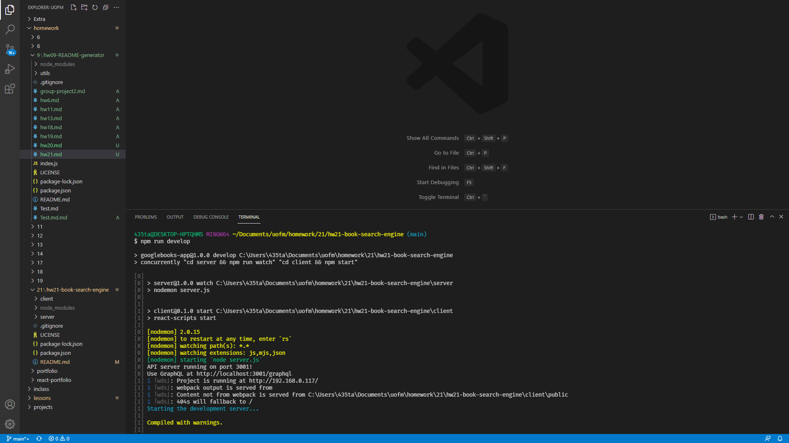

# hw21 Book Search Engine

## Description

With this app you should be able to look up books

## Table of Contents

- [Installation](#installation)
- [Usage](#usage)
- [License](#license)
- [Test](#test)
- [Questions](#questions)

## Installation

run npm install in the console and it should install all the packages you need.

## Usage

run npm run develop that should start up the server then go into the webpage and look for a book with the input field.

  

## License

This project is under the Apache2.0 license.

## Test

search for books and see what happens

## Questions

My GitHub is: [TannerOliver](https://github.com/TannerOliver)  
You can reach me at Email: 435.tanner@gmail.com  
Checkout the deployed application! [Heroku](https://hw21.herokuapp.com/)
